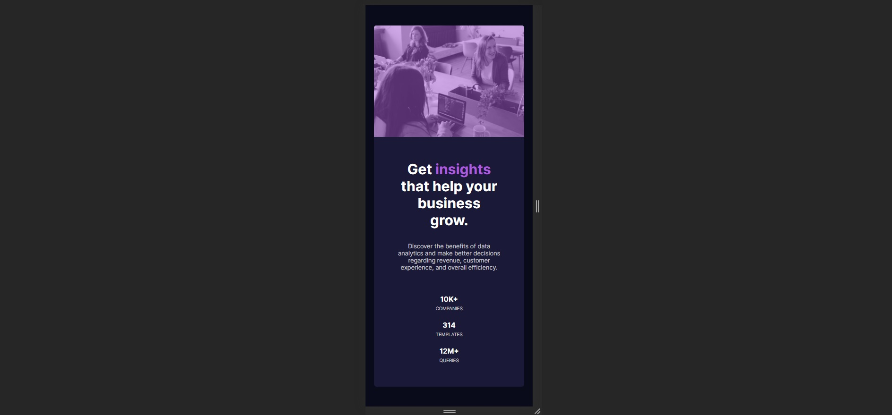

# Frontend Mentor Challenge- Stats preview card component solution

This is a solution to the [Stats preview card component challenge on Frontend Mentor](https://www.frontendmentor.io/challenges/stats-preview-card-component-8JqbgoU62). Frontend Mentor challenges help you improve your coding skills by building realistic projects. 

# 📋 Index

- [Overview](#overview)
  - [The challenge](#the-challenge)
  - [Screenshot](#screenshot)
  - [Links](#links)
- [My process](#my-process)
- [License](#-license)
- [Author](#author)
---
# 📄 Overview

### The challenge

Users should be able to:

- View the optimal layout depending on their device's screen size

### Screenshot
  - Desktop
  

  - Mobile
  

### Links

- Solution URL: [Add solution URL here](https://your-solution-url.com)
- Live Site URL: [Add live site URL here](https://your-live-site-url.com)
---
# 🖥 My process

### Built with

- Semantic HTML5 markup
- CSS custom properties
- Flexbox
- CSS Grid

# 📝 License
This project is under license MIT. See the archive [LICENSE](/LICENSE) for more details.

---
## Author
Developed by Willian dos Santos Souza
- [LinkedIn](https://www.linkedin.com/in/willian-ssouza/) 
- [Frontend Mentor](https://www.frontendmentor.io/profile/willian-souza)

